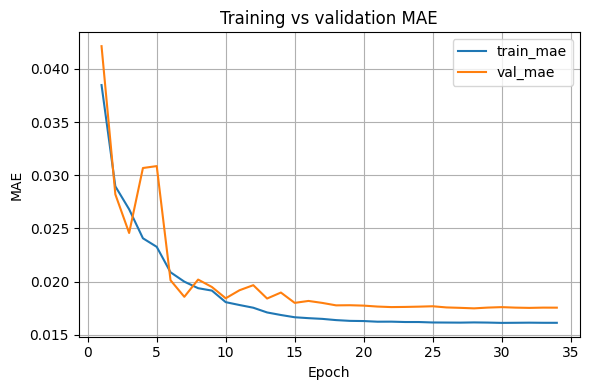
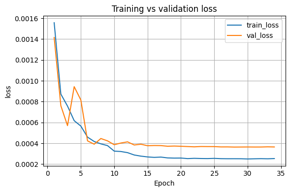

# TEyeD Gaze Regression

A lightweight, high-accuracy deep learning model for 2D near-eye gaze estimation trained on the Dikablis subset of the [TEyeD](https://arxiv.org/abs/2102.02115) dataset.

## Demo predictions

<div align="center">
  
  
</div>

**Note:** These demos were recorded with a handheld smartphone, not the fixed head-mounted eye tracker used in the training data.

## Quickstart

1. Install [uv](https://github.com/astral-sh/uv)

2. Run predictions on your own eye video:
   ```bash
   uv run predict.py --video path/to/your/video.mp4
   ```

Optional arguments:
- `--model` - Path to model checkpoint (default: `trained_models/best_overall.keras`)
- `--output` - Save annotated video (e.g., `--output result.mp4`)
- `--no-display` - Disable preview window
- `--max-frames` - Process only first N frames

Press `p` to pause/resume, `q` or `ESC` to quit.

## Model architecture

- **Backbone**: MobileNetV3Small (alpha=0.75, pre-trained on ImageNet)
- **Input**: 96x96 RGB eye images
- **Output**: 2D coordinates (x, y) in normalized space [-1, 1]
- **Head**: Global Average Pooling → Dropout(0.4) → Dense(128, ReLU) → Dense(2, tanh)
- **Parameters**: ~638K total (629K trainable)

## Training strategy

### Data augmentation

- Photometric augmentation (brightness, contrast, gamma, color temperature)
- Gaussian noise injection
- Random blur and sharpening
- JPEG recompression simulation
- Horizontal flipping with label correction

### Sample weighting

The model uses a dual weighting strategy to address class imbalance:
1. **Radius weighting**: Off-center samples (radius ≥ 0.30) receive 2x weight
2. **Video weighting**: Samples are inversely weighted by video frequency to prevent overfitting to specific videos

### Two-phase training
1. **Phase 1 (6 epochs)**: Fine-tune only the head layers with frozen backbone
2. **Phase 2 (50 epochs with early stopping)**: Full fine-tuning with AdamW optimizer
   - Learning rate: 3e-4 with ReduceLROnPlateau
   - Weight decay: 1e-3
   - BatchNormalization layers kept frozen

## Performance

### Binned MAE by gaze radius
| Radius Range | Sample Count | MAE |
|-------------|-------------|-----|
| [0.00, 0.10) | 4,179 | 0.01910 |
| [0.10, 0.20) | 33,697 | 0.01502 |
| [0.20, 0.30) | 20,918 | 0.01898 |
| [0.30, 0.40) | 2,078 | 0.03134 |
| [0.40, 0.60) | 916 | 0.03409 |
| [0.60, 1.00) | 35 | 0.06939 |

The model maintains high accuracy across different gaze angles, with slightly higher error for extreme off-center gazes (expected due to dataset distribution).

### Training curves

<div align="center">
  
  
</div>

## Dataset

Trained on the Dikablis subset of TEyeD (high-resolution head-mounted eye tracker):
- **Training samples**: 400,131
- **Image size**: 96x96 pixels
- **Preprocessing**: Stride-10 sampling with Q4 quality

## Preprocessing

This repo focuses on training + inference.  
For TEyeD preprocessing (frame extraction, labels generation, dataset utilities), see: https://github.com/jtlicardo/teyed-utils

## Files

- `training_notebook.ipynb` - Complete training pipeline
- `predict.py` - Inference script for generating predictions
- `trained_models/` - Saved model checkpoints

## Citation

This project uses the **TEyeD** dataset. If you use this code or model, please cite the original paper:

```bibtex
@inproceedings{fuhl2021teyed,
  title={TEyeD: Over 20 Million Real-World Eye Images with Pupil, Eyelid, and Iris 2D and 3D Segmentations, 2D and 3D landmarks, 3D Eyeball, Gaze Vector, and Eye Movement Types},
  author={Fuhl, Wolfgang and Kasneci, Gjergji and Kasneci, Enkelejda},
  booktitle={2021 IEEE International Symposium on Mixed and Augmented Reality (ISMAR)},
  pages={367--375},
  year={2021},
  doi={10.1109/ismar52148.2021.00053}
}
```
